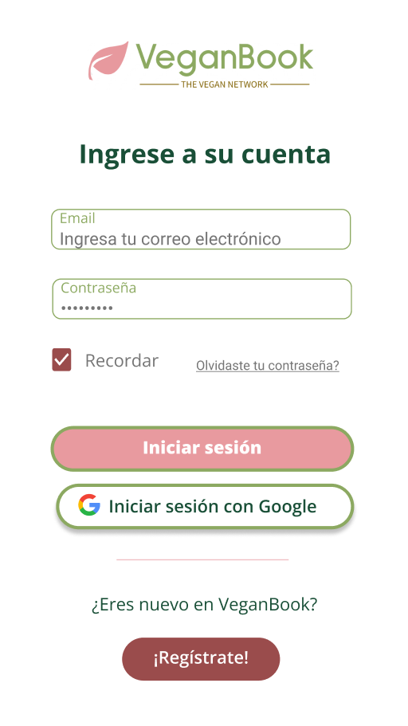

# Red Social Vegan-Book

https://dev-008-social-network-veganbook.vercel.app/

## Índice

* [1. Descripción del Proyecto](#1-descripcion-del-proyecto)
* [2. Hallazgos](#2-hallazgos)
* [3. Historias de Usuario](#3-historias-de-usuarios)
* [4. Prototipos de la Interfaz](#4-prototipos-de-la-interfaz)
* [5. Funcionalidad](#5-funcionalidad)
* [6. Tests ](#6-tests-de-componentes)
* [7. Fundamentos](#7-fundamentos)
* [8. Autoras](#8-autoras)

## 1. Descripción del Proyecto

A través del pair programming creamos una red social inclusiva para la comunidad vegana, donde los usuarios puedan compartir y descubrir contenido relacionado con el veganismo. Además de recetas veganas, la plataforma ofrecerá un espacio para compartir consejos de estilo de vida, recomendaciones de productos éticos, experiencias culinarias, noticias sobre el movimiento vegano y eventos relacionados. El objetivo es promover un estilo de vida vegano integral y brindar a los usuarios la oportunidad de conectarse, aprender y apoyarse mutuamente en su viaje vegano.

**Objetivos de este proyecto:**

* Desarrollar una SPA con temática de red social.

* Aplicar los conceptos de responsividad en el desarrollo de las vistas (templates).

* Implementar un router para la navegación entre las diferentes vistas de la aplicación.

* Emplear un servicio externo para la persistencia de datos de la aplicación

* Crear una suite de pruebas unitarias que permitan testear código asíncrono.

## 2. Hallazgos

Para descubrir las necesidades de los usuarios y llegar a la definición final de la red social para veganos, realizamos un estudio centrado en la comunidad vegana analizando el mercado de recetas veganas y redes sociales existentes para identificar las oportunidades y necesidades no satisfechas.

**1.1.	¿Quiénes son los principales usuarios del producto?** 
* Personas que siguen una dieta vegana, ya que pueden encontrar y compartir recetas que se ajusten a sus necesidades alimenticias.

* Personas con alergias e intolerancia alimentaria que necesitan opciones sin ciertos ingredientes (huevos, lácteos o gluten), esta red social les permitiría encontrar recetas alternativas y adaptaciones para satisfacer sus necesidades alimenticias. 

* Personas que se consideran flexitarianos, es decir, que no siguen una dieta estricta vegana-vegetariana, pero que buscan reducir su consumo de productos provenientes de animales a través de ideas y opciones para incorporar en su dieta comidas basadas en plantas.

* Personas que quieren conocer el estilo de vida vegano y probar recetas más saludables, incorporando ingredientes naturales y disminuiro evitar productos procesados.

**1.2. 	¿Qué problema resuelve el producto y para qué le servirá a estos usuarios?** 
* Acceso a recetas veganas: Proporciona a los usuarios una amplia variedad de recetas veganas en un sólo lugar (desde platos principales hasta postres). Puede ser muy difícil para muchas personas encontrar recetas veganas específicas o variadas, y esta red social facilita el acceso a una gran cantidad de opciones culinarias veganas.

* Inspiración y motivación: Los usuarios pueden publicar mensajes inspiradores, citas, imágenes y reflexiones personales que promuevan una vida vegana. Pueden compartir historias de transformación personal, beneficios para la salud y el bienestar, así como logros alcanzados siendo personas veganas. 

* Comunidad y apoyo: Al centrarse en la comunidad vegana, esta red social crea un espacio en el que los usuarios pueden conectarse con otros veganos, compartir experiencias, consejos y brindarse apoyo mutuo. Esto puede ser especialmente útil para aquellos que son nuevos en el veganismo o que buscan recursos y orientación para mantener una dieta vegana saludable.

* Promoción de la alimentación vegana: Al proporcionar una plataforma para compartir recetas veganas, la red social contribuye a promover y difundir el estilo de vida vegano y puede inspirar a más personas a adoptar una dieta basada en plantas.

## 3. Historias de Usuarios

#### Historia de Usuario 1: Registro

- [ ] **Yo, usuario interesado en el veganismo, quiero poder registrarme en una red social relacionada al veganismo para acceder a todas las funciones, como crear publicaciones y dar like.** 

Puedes ver con mayor detalle el [formulario](https://forms.gle/yUS5NCKY5RyfY3ei8) para recibir feedback de la Historia de Usuario 1.

- [x] **Criterios de Aceptación:**

  * El usuario puede proporcionar su nombre, email y contraseña para crear una cuenta.
  * El sitio web verifica la validez del correo electrónico del usuario.
  * Una vez registrado, redirige al usuario a la página principal de la web o app móvil.
  * Si el usuario intenta acceder al timeline sin estar registrado, redirije al login.

- [x] **Definición de Terminado:**

  * Diseño responsivo.
  * Debe ser una SPA.
  * Debe haber recibido code review de al menos una compañera de otro equipo.
  * El usuario puede escribir su correo y contraseña.
  * El usuario sólo se puede registrar una sola vez.
  * Si hay errores en el registro por parte del usuario, debe haber mensajes descriptivos para corregirlos.
  * Tiene la opción de autenticarse con una cuenta de Google.
  * La interfaz de usuario muestra el formulario de registro de manera clara y amigable.
  * Código tiene y pasa los test necesarios.
  * Pruebas de usabilidade incorporación del feedback de los usuarios como mejora.
  * Despliegue de la app y etiqueta de la versión (git tag).

#### Historia de Usuario 2: Crear y eliminar publicaciones

- [ ] **Yo, como usuario de la red social para veganos, quiero poder crear publicaciones para compartir contenido relacionado con el veganismo, como recetas, consejos, ideas y experiencias culinarias, para poder interactuar con otros miembros de la comunidad vegana** 

- [x] **Criterios de Aceptación:**

* El usuario puede escribir un texto en su publicación.
* Puede publicar los post que estime necesario.
* Puede eliminar un post en específico.

- [x] **Definición de Terminado:**

* Diseño responsivo.
* Debe ser una SPA.
* Debe haber recibido code review de al menos una compañera de otro equipo.
* Que funcione el input de texto.
* Que tenga la funcionalidad de publicar un post. 
* Que tenga la funcionalidad de eliminar un post.
* Al publicar, se debe validar que exista contenido en el input.
* Pide confirmación antes de eliminar un post.
* El código tiene y pasa los test necesarios.
* Pruebas de usabilidade incorporación del feedback de los usuarios como mejora.
* Despliegue de la app y etiqueta de la versión (git tag).

#### Historia de Usuario 3: Editar publicaciones

- [ ] **Yo, como usuario usuario que escribe constantemente publicaciones en redes sociales, quiero tener la opción de poder editar un post ya publicado, para no tener que eliminar un post en caso de errores y publicarlo de nuevo**

- [x] **Criterios de Aceptación:**

* Cada publicación creada por el usuario tiene la opción de “editar post”, para que la pueda modificar cuantas veces estime necesario. 
* Al momento de editar la publicación, el usuario tiene la opción de “guardar” para que sepa que ya fueron guardados sus cambios.
* Luego de guardar, el usuario pueda ver el post con los cambios realizados.

- [x] **Definición de Terminado:**
* Diseño responsivo.
* Debe ser una SPA.
* Debe haber recibido code review de al menos una compañera de otro equipo.
* Al dar click en editar un post se puede modificar el texto y guardar los cambios.
* Al recargar la página se pueden ver los textos editados.
* Funciona la opción de guardar cambios.
* El código tiene y pasa los test necesarios.
* Pruebas de usabilidade incorporación del feedback de los usuarios como mejora.
* Despliegue de la app y etiqueta de la versión (git tag).

#### Historia de Usuario 4: Like de posts

- [ ] **Yo, como usuario activo de las redes sociales, quiero poder dar y quitar likes a las publicaciones para interactuar con la comunidad**

Puedes ver con mayor detalle el [formulario](https://forms.gle/2PPRQ1zT7WeCyVp78) para recibir feedback del proyecto final.

- [x] **Criterios de Aceptación:**

* Existe un botón donde se puede dar like a una publicación.
* El usuario tiene la opción de eliminar el like si ya no le gusta una publicación.
* Se lleva una cuenta de los likes en una publicación.

- [x] **Definición de Terminado:**

* Diseño responsivo.
* Debe ser una SPA.
* Debe haber recibido code review de al menos una compañera de otro equipo.
* Que funcione la opción de dar like.
* Que funcione la opción de quitar el like.
* Que muestre en la publicación la cuenta de los likes.
* El código tiene y pasa los test necesarios
* Pruebas de usabilidade incorporación del feedback de los usuarios como mejora.
* Despliegue de la app y etiqueta de la versión (git tag).

## 4. Prototipos de la Interfaz

Una vez definidas las historias de usuario, realizamos los prototipos de alta fidelidad para visualizar las ideas que se formaron a partir de las necesidades de nuestro público objetivo. El diseño del prototipo de alta fidelidad fue diseñado en Figma. Realizamos diseños para tres resoluciones distintas: para pantallas de celular, tablet y desktop.

**Versión Celular y Tablet**

**Versión Desktop**

## 5. Funcionalidad

### Creación de cuenta de usuario e inicio de sesión

Como resultado, la interfaz permite al usuario:

* Crear una cuenta y/o registrarse en la red social.
* Crear una cuenta de acceso y autenticación con un email y una contraseña, así como con una cuenta de Google.

#### Validaciones:

* Solamente se permite el acceso a usuarios con cuentas válidas.
* No puede haber usuarios repetidos.
* La cuenta de usuario debe ser un correo electrónico válido.
* Lo que se escribe en el campo (input) de contraseña es secreto.

#### Comportamiento:

* Al enviarse el formulario de registro o inicio de sesión se valida con Firebase.
* Si hay errores, se muestran mensajes descriptivos para ayudar al usuario a corregirlos.

### Creación de Muro/timeline: 

#### Validaciones:

* Al publicar, se valida que exista contenido en el input.

#### Comportamiento:
* Al recargar la aplicación, se verifica si el usuario está logueado antes de mostrar el contenido.
* Se puede publicar un post.
* Se puede dar y quitar like a una publicación. 
* Se lleva una cuenta de los likes.
* Se puede eliminar y/o editar un post específico.
* Se pide confirmación antes de eliminar y/o editar un post.
* Se guardan los cambios con la información editada.
* Al recargar la página el usuario puede ver los textos editados.

## 6. Tests: 

### Usabilidad: 

Realizamos dos encuestas para obtener feedback de los usuarios para la red social. Algunas sugerencias fueron incoporadas y otras se considerarán en caso de tener la oportunidad de profundizar en el proyecto. 

### Componentes: 

Para testear las funciones de este proyecto construimos pruebas de componentes, haciendo énfasis en Login y Register, las cuales tuvieron una cobertura de más de 90% en rentencias, ramas y líneas, y 75% en funciones. 

## 7. Fundamentos
HTML, CSS, Javascript, Firebase, Firestore, Git Colaborativo.

## 8. Autoras

Leslie Garibay, Yennyfer Jarava, Ignacia Silva.

